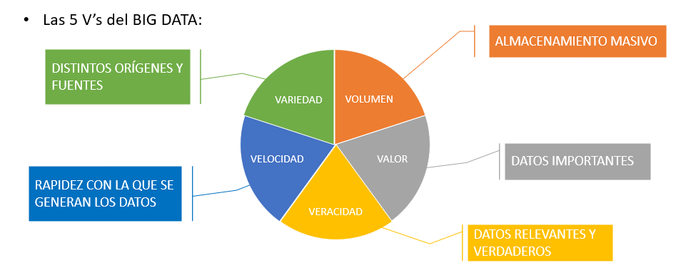
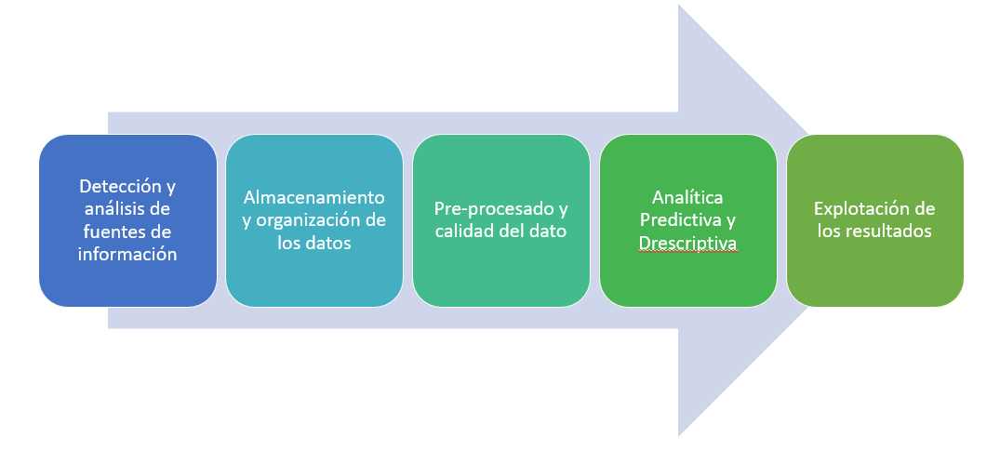

# Big Data
El gran volumen de datos que ha comenzado a generarse en la última década debido a la capacidad de almacenamiento y procesamiento surgida por nuevas tecnologías.

La información referente a una empresa, se genera dentro y fuera de ella. El control de la información generada y la naturaleza de la misma ha dejado de ser centralizada en la empresa. Capturar, procesar, entender y actuar en consecuencia permite a las empresas comprender rápidamente el entorno en que se mueven en la erea de las redes sociales y tener una ventaja competitiva respecto a sus rivales.
## Introducción

## Las 5 Vs

{ align=left }

## Fases de los proyectos Big Data

1. `Detección y análisis de fuentes de información` - ver el origen de nuestra información que puede ser muy variada, puede ser de logs, de redes sociales, etc.
2. `Almacenamiento y organización de los datos` - ver como vamos a almacenar nuestros datos, si en la nube, en nuestro sistema o de una manera híbrida. 
3. `Pre-procesado y calidad del dato`- vamos a ver que información es importante para nosotros, que información es redundante, cuanta información falta que es de vital importancia para nosotros.
4. `Analítica Predictiva y Descriptiva`- una vez que tenemos los datos, tenemos que entender que está ocurriendo y para ello tenemos aproximaciones para obtener conclusiones de esta información.
5. `Explotación de los resultados`- la comunicación mediante la generación de informes, a través de cuadros de mandos o que sirva de entrada para otro proceso.
{ align=left }

## Tipos de almacenamientos

- `ON-PREMISE`- Cuando la información se almacena en servidores, racks locales, instalados en la propia organización.
- `CLOUD`- Cuando se utiliza las infraestructuras de terceros (AWS, Google, ...).
- `HYBRID CLOUD`- Cuando se produce una combinación entre la nube pública y la nube privada.
- `EDGE`- El almacenamiento y procesamiento de la información se produce cerca del punto de recolección.