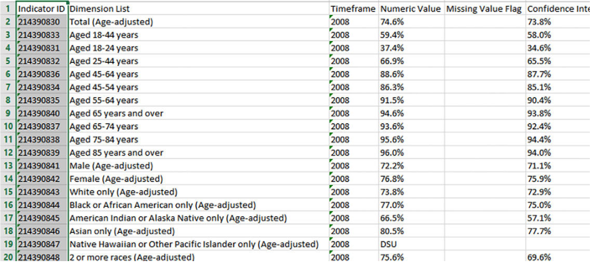
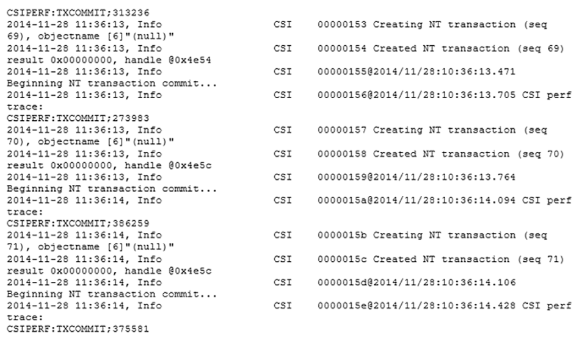
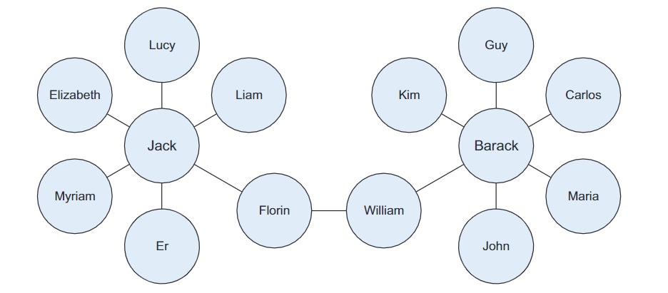

#TIPOS DE DATOS

##Estructurados

Los datos estructurados son datos que dependen de un modelo de datos y se encuentran en un campo fijo dentro de un registro.

{ align=left }

##No estructurados

Los datos no estructurados no encajan en un modelo de datos específico. Un ejemplo de datos no estructurado puede ser un correo electrónico habitual. Aunque el correo electrónico contiene elementos estructurados como el remitente, el título y el cuerpo del texto, el contenido del cuerpo es lo que contiene datos no estructurados.

{ align=left }

##Lenguaje Natural

El lenguaje natural es un tipo especial de datos no estructurados; es un desafío ya que para ser procesado se requiere de conocimiento de técnicas específicas de ciencia de datos y lingüística.
El procesamiento del lenguaje natural ha tenido éxito en el reconocimiento de entidades, de temas, resumen, finalización de texto y análisis de sentimientos, pero los modelos entrenados en un dominio no generalizan bien a otros dominios.
##Generado por máquinas

Los datos generados por la máquina son información que es creada automáticamente por un ordenador, proceso, apliación u otra máquina sin intervención humana. Ejemplos de datos de la máquina son los registros del servidor web, los registros de detalles de llamada, los registros de eventos de red y la telemetría.

{ align=left }

##Basados en gráficos

Un grafo es una estructura matemática para modelar relaciones por pares entre objetos. Las estructuras de los gráficos utilizan nodos, bordes y propiedades para representar y almacenar datos gráficos. Los datos basados en gráficos son una forma natural de representar las redes sociales, y su estructura le permite calcular métricas específicas como por ejemplo el camino más corto entre dos personas.La lista de seguidores en Twitter es otro ejemplo de datos basados en gráficos.
{ align=left }

##Audio, vídeo e imágenes

El audio, la imagen y el vídeo son tipos de datos que plantean desafíos específicos para un científico de datos. Las tareas que son triviales para los humanos, como reconocer objetos en imágenes, resultan ser un desafío para los ordenadores. Recientemente, una empresa llamada DeepMind logró crear un algoritmo capaz de aprender a jugar a videojuegos. Este algoritmo toma la pantalla de vídeo como entrada y aprende a interpretar todo a través de un complejo proceso de deep learning. Es una hazaña que llevó a Google a comprar la empresa para sus propios planes de desarrollo de Inteligencia Artificial.

##Streaming

Los datos en streaming fluyen hacia el sistema cuando ocurre un evento en lugar de cargarse en un almacén de datos en un lote. Algunos ejemplos son las "tendencias" en Twitter, eventos deportivos o musicales en vivo y el mercado de valores.
