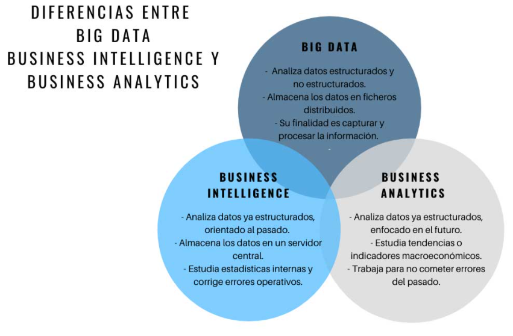

# INTRODUCCIÓN 

## ¿Dónde nacen los datos de hoy en día?
{ align=left }

Los datos que nosotros utilizamos hoy en día se generan principalmente a través de nuestro móvil, la sensórica y los sistemas de gestión de nóminas, contabilidad, etc.

{ align=left }

!!! Note
    Cantidad de datos que se generan por minuto en el año 2020

## Beneficios y usos del Big Data
La ciencia de datos y el Big Data se utilizan tanto en entornos comerciales con en no comerciales.
Las empresas comerciales lo utilizan para obtener información sobre sus clientes, procesos, personal, productos, etc.
Las instituciones financieras utilizan la ciencia de datos para predecir los mercados de valores, determinar el riesgo de presatar dinero y aprender a atraer nuevos clientes para sus servicios. 
Las organizaciones gubernamentales también son conscientes del valor de los datos. Muchas organizaciones no solo dependen de los científicos de datos internos para descubrir información valiosa sino que también comparten sus datos con el público. Pueden utlizar estos datos para obtener conocimientos o crear aplicaciones basadas en datos.
Las organizaciones no gubernamentales (ONG) tampoco son ajenas al uso de datos. Lo utilizan para recaudar fondos y defender sus causas. El Fondo Mundial para la Naturaleza (WWF), por ejemplo, emplea científicos de datos para aumentar su efectividad de sus esfuerzos de recaudación de fondos. 
Las universidades utilizan la ciencia de datos en sus investigaciones, pero también para mejorar la experiencia de estudio de sus estudiantes.

## Definiciones

* `DATA SCIENCE` - Es una ciencia interdisciplinar basada en el análisis de datos. Su objetivo es generar valor a partir de la recopilación, clasificación, visualización e interpretación de datos.
* `BIG DATA` - hace referencia a un volumen de datos tan ámplio y complejo de datos que las técnicas tradicionales no pueden abordar siendo necesaria una aproximación específica para este tipo de problemas.
* `BUSINESS INTELIGENCE` - es una disciplina relacionada con la ciencia de datos y el BIG DATA pero se orienta más al entorno empresarial, con la finalidad de pemitir la toma de decisiones, la consecución de índicadores de idoneidad del negocio KPI's y en consecuencia la optimización de los productos o servicios que ofrece dicha empresa.

* `BUSINESS ANALYTICS` - 

{ align=left }

## Data Warehouse y Data Lake

¿Dónde almacenamos toda la información que tenemos?

* `Data Warehouse` - es el lugar donde a través de una base de datos se integran todos los datos que tengo para después poder visualizar esos datos, aplicar algoritmos, etc. Es decir, es la centralización de todos los datos en una misma base de datos. Es una base de datos estructurada.
* `Data Lake` - Es similar al data Warehouse pero la información no está estructurada.

##El proceso de ciencia de datos

1. `Establecer el objetivo de la investigación`- Cuando se realiza un proyecto de ciencia de datos, tenemos que tener claro el objetivo y características como qué se va a investigar, cómo se beneficia la empresa, qué datos y recursos necesita, qué calendario de entrega tiene, etc.
2. `Recopilar datos`- Recolección de datos tanto de la empresa como de terceros verificando la existencia, la calidad y el acceso a los datos.

3. `Preparación de datos`- La recopilación de datos, puede llevar a datos erróneos, por lo tanto, en esta fase se mejora la calidad de los datos y se preparan para su uso en las siguientes fases. Se realiza una limpieza de datos para asegurar que los datos estén en un formato adecuado para utilizar en sus modelos.
4. `Exploración de datos`- para la comprensión más profunda de los datos. Se intenta comprender cómo las variables interactúan entre sí, la distribución de los datos y si existen valores atípicos. Para lograr esto, se utilizan principalmente estadísticas descriptivas, técnicas visuales y modelado simple.
5. `Modelado de datos o construcción de modelos`- en esta fase se utilizan modelos de conocimientos sobre los datos que se encontró en la fase anterior para poder responder a la fase de investigación. Se seleccionan técnicas de los campos de la estadística, aprendizaje automático, investigación de operaciones, etc. La construcción de un modelo es un proceso iterativo que implica la selección de las variables para el modelo, la ejecución y los diagnósticos del modelo.

6. `Presentación y automatización`- Se presentan los resultados de diferentes formas, desde presentaciones hasta informes de investigación.